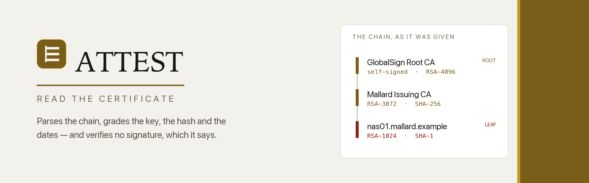
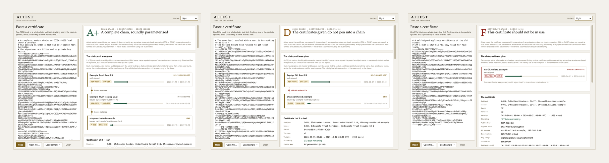

<div align="center">

<picture>
  <source media="(prefers-color-scheme: dark)" srcset="images/banner-dark.png">
  
</picture>

<br>

**Read the certificate.** An offline X.509 reader that walks the DER by hand,
names every field in plain words, draws a pasted chain as a ladder so you can
see whether it actually joins, and grades what it finds — without ever
verifying a signature, checking revocation, consulting a trust store, or
calling anything safe.

<br>


</div>

---

## Why

A certificate is a public document that almost nobody reads. The padlock either
appears or it does not, and when it does not, the error message is four words
long — *unable to get local issuer* — while the actual answer is sitting in the
bytes the server just sent you.

Attest opens those bytes. Paste a PEM block, or a whole chain, and it tells you
three things no browser dialog will:

- **What it names** — the subject and issuer distinguished names attribute by
  attribute, every subjectAltName entry, the serial, the key identifiers, the
  SHA-256 fingerprint.
- **What it rests on** — the signature algorithm, the public key and its real
  size (the modulus bit length, not the byte count), the named curve, the
  constraints and usages it declares.
- **Whether it joins** — each adjacent pair in the chain, drawn as a ladder: a
  solid gold connector when the child's issuer name matches the parent's
  subject name, a dashed red one when it does not.

Then it grades the whole thing, A+ to F — and the ladder is graded too. Each
rung's spine, role marker and badges take the colour of the worst finding on
*that* certificate, so a 1024-bit key or a SHA-1 signature arrives in red
beside a sound certificate still in gold. A grade of F cannot be drawn looking
like an A+.

<div align="center">
<picture>
  <source media="(prefers-color-scheme: dark)" srcset="images/screens-dark.png">
  
</picture>
<br>
<sub>A complete chain (A+), a leaf bundled with the wrong root (D), and a
SHA-1 certificate over a 1024-bit key (F) — three different things the ladder
can say.</sub>
</div>

## The honest part

Attest reads bytes. That is the whole of it, and the whole of what it claims:

- It **does not verify any signature.** It reports the algorithm a certificate
  names; it does no public-key arithmetic.
- It **does not check revocation.** No CRL, no OCSP, no network.
- It **does not consult a trust store.** A "self-signed root" here is a
  certificate whose issuer name equals its subject name — not one your system
  trusts.
- It **cannot know** whether a live server still holds the matching private key.

So a high grade means *the certificate is well-formed and uses sound
parameters* — never that a connection using it is trustworthy. The words
"safe", "secure" and "trusted" never appear as a verdict, and a test enforces
that.

That line shapes the whole grader:

- **A+ is reserved** for a complete chain — every link joining, ending in a
  self-signed certificate — with nothing above an informational note. Nothing
  less reaches it.
- **Unknown beats a guess.** A lone certificate says nothing about the chain
  above it, so it is capped at **B+** and labelled *chain above it is unknown*.
  A signature algorithm or curve that is not in the table caps the grade at
  **C** rather than being assumed strong. A broken join caps it at **D**,
  because the bundle is not a chain.
- **Properties, not brands.** Every penalty is a property of the certificate —
  an elapsed date, a 1024-bit modulus, a missing subjectAltName, two names that
  do not join. Attest keeps no list of issuers it likes.

## Install

```bash
git clone https://github.com/at0m-b0mb/Attest.git
cd Attest
python3 -m pip install -r requirements.txt   # just PyQt6, for the window
python3 -m pip install .                     # puts `attest` on your PATH
```

The analysis engine and the command line need **no dependencies at all** — only
the standard library, including the ASN.1 DER parser. PyQt6 is required solely
for the graphical reader.

The second line is only for the `attest` command. Skip it and run everything
as `python3 -m attest` from the checkout instead; nothing else needs it.

## Run

**The window:**

```bash
python3 -m attest          # or:  python3 run.py
```

Paste a PEM certificate, open a `.pem` / `.crt` / `.der`, or load one of the
bundled samples. Switch between **Light**, **Dark** and **Auto** from the
top-right.

**The command line** — same engine, no Qt, pipe-friendly:

```bash
python3 -m attest server.pem                       # always works, no install
attest server.pem                                  # after `pip install .`
attest chain.pem --json                            # machine-readable
cat cert.pem | attest -                            # from a pipe
attest --version

# the pipe does the networking; Attest never does
openssl s_client -connect example.com:443 -showcerts </dev/null | attest -
```

The exit code answers *did a certificate come out of this?*, so a shell can
branch on it:

| Code | Meaning |
|---|---|
| `0` | At least one certificate was read. The grade is in the output, not the exit code — Attest reports, and what is good enough to deploy is not its call |
| `1` | Nothing in the input parsed as a certificate. The report still prints, and says why |
| `2` | The input could not be read at all — no such file, or nothing on stdin |

```
  A+   A complete chain, soundly parameterised  (100/100)
  Attest reads the certificate you pasted. It does not verify any signature,
  does not check revocation (CRL or OCSP), does not consult a trust store…

LEAF  shop.northwind.example
  subject     C=GB, ST=Greater London, O=Northwind Retail Ltd, CN=shop.…
  issuer      C=GB, O=Example Trust Services, CN=Example Trust Issuing CA 2
  validity    2026-09-15 → 2027-10-10  372 days left
  key         EC prime256v1 (P-256)
  signature   ecdsa-with-SHA256
  alt names   shop.northwind.example, www.northwind.example

Chain (2 joins)
  shop.northwind.example --- Example Trust Issuing CA 2   issuer matches
  Example Trust Issuing CA 2 --- Example Trust Root R3    issuer matches
  chain: complete as given
```

## The parser

There is no certificate library here. `attest/core/asn1.py` is a DER
tag/length/value walker written for this tool, and `attest/core/certificate.py`
walks the `Certificate` structure of RFC 5280 on top of it. It is strict where
leniency would be a lie:

| Input | What Attest does |
|---|---|
| Indefinite-length encoding | Refuses it by name — that is BER, and DER forbids it |
| A length past the end of the buffer | Error, not a silent truncation |
| Trailing bytes after a complete value | Reported, not dropped |
| Children that overrun their parent | Error |
| An OID not in the table | Comes back in dotted form, never guessed |
| An extension whose body will not parse | Listed, believed about nothing, noted |
| A 2047-bit RSA modulus | Reported as 2047, not rounded to 2048 |

The samples in `samples/` are built by `tools/gen_samples.py`, which encodes
real DER by hand — so the fixtures the tests assert against are genuine X.509
structures the parser walks exactly as it would walk one off a live server, not
mocks standing in for them.

## How the grade is built

Attest starts at 100 and subtracts for what it finds. Each subtraction is a
finding, written so you can act on it:

| Signal | What trips it |
|---|---|
| **Validity** | expired, not yet valid, under 30 days to run, or over 398 days for an end-entity certificate |
| **Signature** | MD5 / MD4 / MD2 (collisions are cheap), SHA-1 (collisions are demonstrated) |
| **Key** | RSA below 2048 bits, a curve below P-256, a public exponent under 65537, DSA |
| **Identity** | no subjectAltName on a server certificate, an empty one, a commonName absent from it, a wildcard |
| **Constraints** | CA:TRUE in a leaf's position, a non-critical CA declaration, keyCertSign against CA:FALSE, no keyUsage or extendedKeyUsage |
| **Format** | X.509 v1, a duplicated extension, a version/extension contradiction, a negative serial |
| **Chain** | a join whose names do not match, key identifiers that disagree where the names agree, an issuer not marked as a CA, a chain that stops short of a root |

Findings are sorted most-severe first and shown with the points they cost, so
the reasoning behind the letter is always on screen. A `GOOD` or `INFO` finding
never costs anything — it is there so the report says what is *right* as well
as what is wrong.

## Privacy

Attest never touches the network. It opens no sockets, resolves no names, and
sends nothing anywhere — the whole analysis is the standard library reading
bytes you already have. A certificate you paste in stays on your machine.

It also has no use for a private key, and says so if you paste one.

## Tests

```bash
python3 -m pip install -r requirements-dev.txt
python3 -m pytest -q
```

436 tests cover the DER walker (including every malformed shape it must
refuse), the OID table, the PEM extractor, the certificate parser against
hand-built DER, the full grading pipeline and its honesty ceilings, the CLI's
text, JSON and exit codes, the painted ladder rendered off-screen in both
themes — including that an F certificate's rung does *not* come out the colour
of an A+ one, asserted on the pixels rather than on the intent — and, as the
house style demands, every text/background colour pairing against WCAG AA.

## Layout

```
attest/
  core/            the engine — pure standard library, no Qt
    asn1.py          a DER tag/length/value walker, written for this
    oids.py          the dictionary: algorithms, curves, RDNs, extensions
    model.py         the dataclasses everything speaks in
    pem.py           a paste  ->  the DER blocks inside it
    certificate.py   DER  ->  a structured Certificate
    grade.py         findings, the chain, and the letter with its ceiling
  ui/              the window
    theme.py         the design system: one place for every token
    chain.py         the chain ladder — Attest's signature element,
                     tinted by the worst finding on each rung
    widgets.py       cards, chips, key/value rows
    main_window.py   the reader itself
  cli.py           the same engine on the command line
samples/           synthetic certificates: a modern chain, a mismatched
                   bundle, an expired leaf, a CN-only leaf, a SHA-1 relic
tests/             436 tests, including the contrast suite
tools/             sample generation, screenshot capture, repository art
```

## Colophon

Set in **Iowan Old Style** for identity and figures, the system **sans** for
anything you read, and a **mono** for raw data — a serif/sans/mono mix that
reads as authored rather than assembled. The palette is warm paper and two
golds: a deep brass legible as small text, and a brighter shine used only on
marks that carry no words. Dark mode is true black, with nothing in the ramp
that reads as blue. Every colour is declared as a light/dark pair, and a test
suite holds every pairing to WCAG AA so the theme can never quietly regress.

## License

MIT — see [LICENSE](LICENSE). For authorised, educational, and personal use:
Attest is a reader, not a certificate authority.
